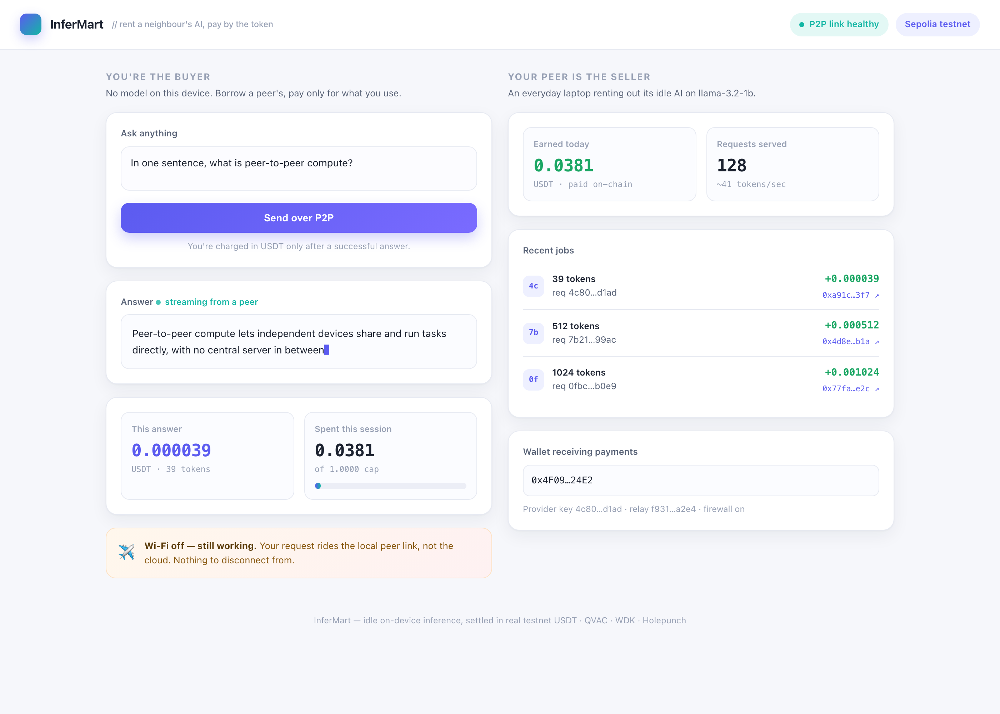
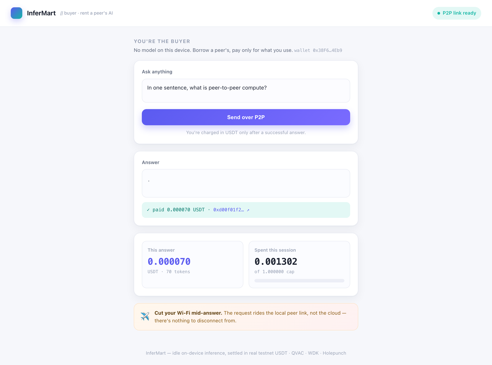
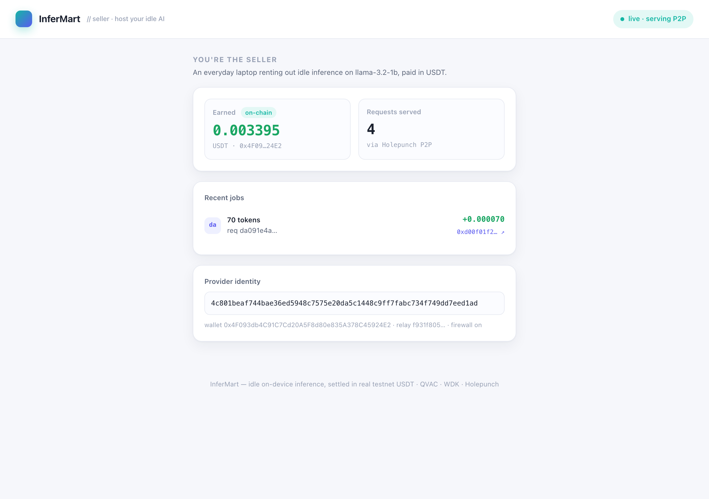

# InferMart: peer-to-peer marketplace for idle on-device AI

Rent a neighbour's spare AI inference over an encrypted P2P link and pay per token in real testnet USDT. No servers, no cloud, no cluster.

[](https://www.typescriptlang.org/)
[](https://nodejs.org/)
[](https://docs.qvac.tether.io/)
[](https://docs.wdk.tether.io/)
[](LICENSE)
[]()



## What is InferMart?

A laptop running a local model (the seller) sells its spare inference to a peer that has no model (the buyer). The prompt travels over a Holepunch peer-to-peer link, runs on the seller's hardware, and the answer streams back. Every request is metered by tokens and paid for with a real on-chain USDT transfer. Each node is a single consumer device, which is exactly what the Tether QVAC hackathon rewards.

Two parts are real and never faked: QVAC delegated inference over Holepunch (`@qvac/sdk`), and WDK testnet USDT settlement.

## Screenshots

| Buyer (no local model) | Seller (hosting the model) |
|---|---|
|  |  |

## Features

- **Pay per token in USDT.** Each answer is metered by `generatedTokens` and settled with a real Sepolia USDT transfer. The buyer surfaces the tx hash; the seller reads its own balance straight off the chain.
- **Buyer needs no model.** It loads nothing locally and delegates the whole completion to the seller over Holepunch.
- **Works without the internet.** Cut the buyer's WAN mid-answer and the stream keeps going over the local relay link. Cloud AI cannot do this.
- **Spend cap that can't be crossed.** The buyer sets a per-session USDT cap. A request that would exceed it is never sent.
- **Two clean dashboards.** Buyer on `:4801`, seller on `:4802`, both live over Server-Sent Events.
- **One command to run it all.** `npm run demo` starts the relay, the seller, and the buyer, and opens both dashboards.

A real settlement from a live run: [`0x86ef9b16…`](https://sepolia.etherscan.io/tx/0x86ef9b16d29f32e578a4159c1756c7594bf0dbce8eea9b42b5bc0201eeb9f082). The seller's on-chain balance moved by exactly the metered amount.

## Tech stack

| Layer | Technology |
|---|---|
| P2P inference | `@qvac/sdk` delegated provider/consumer over Hyperswarm/hyperdht (Holepunch) |
| NAT traversal | `blind-relay` (TURN-style relay for same-network demos) |
| Settlement | `@tetherto/wdk-wallet-evm` on EVM Sepolia, USDT ERC-20 transfer |
| Model | `llama-3.2-1b-instruct` Q4 (~0.7 GB), fetched from the QVAC distributed registry |
| Runtime | Node 22+ with native TypeScript type-stripping (no build step) |
| Dashboards | Plain HTML + inline CSS + EventSource. No framework, no bundler |
| Tests | `node:test` on the metering money-path |

## How it works

```
 BUYER DEVICE                                    SELLER DEVICE
 dashboard :4801                                 dashboard :4802
   |  HTTP + SSE                                   ^  HTTP + SSE
   v                                               |
 buyer process  ===  Holepunch (DHT / relay)  ===  seller process
   client.ts:  loadModel({delegate})              startQVACProvider()  inference.ts
   wallet.ts:  WDK send USDT  ----  on-chain USDT  ---->  settlement.ts reads balance
```

The money path (`packages/shared/metering.ts`) is the only test-driven code, because a bug there means lost funds. The blind relay only forwards opaque encrypted frames, so the inference stays end-to-end encrypted. On two devices on different networks the relay is not needed.

See [docs/architecture.md](docs/architecture.md) and [docs/spike-findings.md](docs/spike-findings.md) for the full design and the de-risking notes.

## Running locally

Prerequisites: Node 22 or newer, on macOS or Linux.

```bash
git clone https://github.com/ajanaku1/InferMart.git
cd InferMart
npm install --registry=https://registry.npmjs.org   # QVAC/WDK live on the official registry

# 1. Create the buyer and seller wallets (secrets go to a gitignored .env)
npm run fund-wallets
#    Fund the printed BUYER address with a little Sepolia ETH for gas:
#    https://faucet.quicknode.com/ethereum/sepolia

# 2. Deploy the test USDT and mint 1,000,000 to the buyer
npm run deploy-usdt
#    (or point USDT_CONTRACT in .env at any existing Sepolia faucet token)

# 3. Prove a real on-chain settlement end to end (recommended)
npm run verify-settlement

# 4. Launch the demo: relay, seller, buyer, and both dashboards
npm run demo
```

Open the buyer dashboard at `http://localhost:4801`, type a prompt, and watch tokens stream in while USDT settles on both sides. The first delegated call cold-boots the DHT in about 20 seconds; later calls are sub-second, so do one warm-up request before recording a demo.

To see the "no cloud" moment, start a request and turn off Wi-Fi while it answers. The stream continues over the local link.

## Scripts

| Command | What it does |
|---|---|
| `npm test` | Metering money-path tests |
| `npm run fund-wallets` | Generate buyer/seller wallets, print addresses |
| `npm run deploy-usdt` | Compile and deploy MockUSDT, mint to the buyer |
| `npm run verify-settlement` | Prove one real USDT transfer lands end to end |
| `npm run demo` | Relay, seller, and buyer in one command |
| `npm run relay` / `seller` / `buyer` | Run a single component |

## Project structure

```
InferMart/
├── packages/
│   ├── shared/      protocol, metering (TDD), WDK helpers, dashboard server
│   ├── seller/      provider + dashboard + on-chain balance watch
│   ├── buyer/       delegated client + USDT settler + dashboard
│   └── relay/       Hyperswarm blind relay for same-network demos
├── contracts/       MockUSDT.sol (6-decimal test USDT)
├── scripts/         fund-wallets, deploy-usdt, verify-settlement, demo.sh
├── proposals/       UI direction mocks
├── docs/            architecture, spike findings, demo narration
└── tests/           metering money-path tests
```

## What is real vs. mocked

Real, never mocked: QVAC delegated inference, token metering, the on-chain USDT transfer, the seller's keyless balance read, the buyer spend cap.

Mocked or out of scope (noted here, not hidden): seller discovery (the provider key is passed out of band), dynamic pricing, multi-seller routing, reputation, escrow, mainnet, mobile clients. The bundled `MockUSDT` is a 6-decimal test token named USDT for the Sepolia demo; point `USDT_CONTRACT` at a different faucet token if you prefer.

## Security

No secrets in the repo. Wallet mnemonics, identity seeds, and the deployed contract live only in `.env`, which is gitignored. The repo ships `.env.example` with empty placeholders. The relay identity controls no funds.

## License

[MIT](LICENSE).
