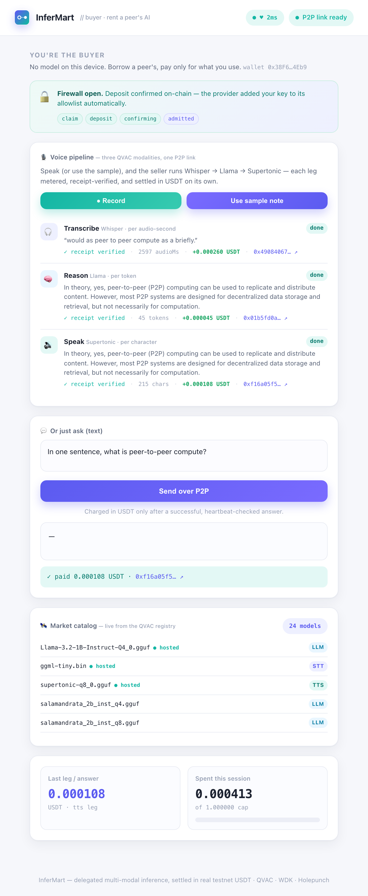
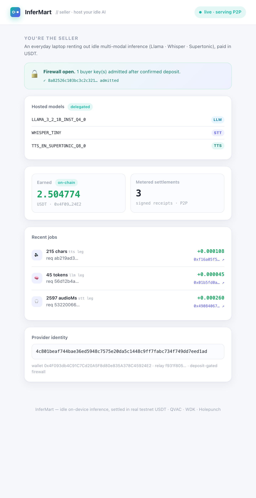

<p align="center">
  
</p>

# InferMart: peer-to-peer marketplace for idle on-device AI

Rent a neighbour's spare AI over an encrypted P2P link and pay per unit of work in real testnet USDT. A full voice assistant (speech-to-text, reasoning, and text-to-speech) runs on someone else's laptop, each leg metered and settled on its own. No servers, no cloud, no cluster.

[](https://www.typescriptlang.org/)
[](https://nodejs.org/)
[](https://docs.qvac.tether.io/)
[](https://docs.wdk.tether.io/)
[](LICENSE)
[]()


## Live demo

**[landing-nu-red.vercel.app](https://landing-nu-red.vercel.app)**. Watch the demo video and see how the marketplace works at a glance. The marketplace itself runs locally on two peers; see [Running locally](#running-locally).

## What is InferMart?

A laptop running local models (the seller) sells its spare inference to a peer that has no model (the buyer). The buyer records a voice note; it travels over a Holepunch peer-to-peer link to the seller, where Whisper transcribes it, Llama answers, and Supertonic speaks the reply. Three QVAC modalities, one P2P link. Each leg is metered by its own unit (audio-seconds, tokens, characters) and paid for with a separate on-chain USDT transfer, backed by a receipt the seller signs and the buyer verifies before paying.

Two pillars are real and never faked: QVAC delegated inference over Holepunch (`@qvac/sdk`), and WDK testnet USDT settlement.

## Screenshots

| Buyer (no local model) | Seller (hosting the models) |
|---|---|
|  |  |

## Features

- **A three-modality voice pipeline.** Speak → Whisper transcribes → Llama answers → Supertonic speaks back, every leg delegated to the seller and settled separately. Priced per audio-second, per token, and per character.
- **Provider-signed usage receipts.** A custom QVAC plugin runs inside the seller's provider worker, counts usage there, and signs a receipt with the provider's own Holepunch key. The buyer verifies the signature before paying and rejects any tampered receipt. Payment no longer trusts buyer-side stats.
- **A firewall that opens on payment.** A fresh buyer key is refused by the seller until its USDT deposit confirms on-chain. The seller watches the chain and adds the key to the QVAC firewall automatically. No provider key is ever passed out of band.
- **Live market catalog.** The buyer lists real models from the QVAC registry (`modelRegistrySearch`) instead of a hardcoded constant, and flags which ones the seller hosts.
- **Heartbeat-gated payments.** Before every paid request the buyer pings the provider and shows the latency. A failed heartbeat blocks the request, so you never pay for a dead provider.
- **Spend cap that can't be crossed.** The buyer sets a per-session USDT cap. Any leg that would exceed it is never sent.
- **One command to run it all.** `npm run demo` bundles the metering worker, then starts the relay, seller, and buyer, and opens both dashboards.

A real settlement from a live run: [`0x86ef9b16…`](https://sepolia.etherscan.io/tx/0x86ef9b16d29f32e578a4159c1756c7594bf0dbce8eea9b42b5bc0201eeb9f082). The seller's on-chain balance moves by exactly the metered amount, one transfer per leg.

## Tech stack

| Layer | Technology |
|---|---|
| P2P inference | `@qvac/sdk` delegated provider/consumer over Hyperswarm/hyperdht (Holepunch) |
| Voice modalities | QVAC Whisper (`transcribe`) + Supertonic TTS (`textToSpeech`) + Llama (`completion`) |
| Provider metering | Custom QVAC plugin (`definePlugin`/`defineHandler`) bundled into the provider worker |
| Access control | QVAC firewall (`ProvideParams.firewall`), opened by a confirmed on-chain deposit |
| Discovery | QVAC model registry (`modelRegistrySearch`) for the buyer catalog |
| Liveness | QVAC `heartbeat` before each paid request |
| NAT traversal | `blind-relay` (TURN-style relay for same-network demos) |
| Settlement | `@tetherto/wdk-wallet-evm` on EVM Sepolia, USDT ERC-20 transfer per leg |
| Models | `llama-3.2-1b` Q4, `whisper-tiny`, `supertonic-q8`, from the QVAC distributed registry |
| Runtime | Node 22+ with native TypeScript type-stripping (no build step) |
| Dashboards | Plain HTML + inline CSS + EventSource. No framework, no bundler |
| Tests | `node:test` on the money-path: receipts, per-modality metering, deposit gate |

## How the delegation works (and one honest gap)

The seller's `startQVACProvider()` proxies every inbound request type to its plugin handlers, so it serves `transcribe`, `textToSpeech`, and custom plugin calls just as readily as `completion`. In SDK 0.13.5, though, the *consumer* side only routes `loadModel`, `completion`, `heartbeat`, `unloadModel`, and `cancel` to a delegated provider. So for the Whisper and Supertonic legs, InferMart speaks the SDK's own wire protocol directly: `hyperdht` connect, `bare-rpc` framing, the same zod-validated JSON frames over the same relay and the same firewall. The inference is genuinely delegated and genuinely QVAC; only the consumer-side routing is ours. The chat completion leg still uses the SDK's built-in `loadModel({ delegate })`. Both are documented in [docs/spike-findings.md](docs/spike-findings.md), which also records the two half-day spikes this phase rests on.

## Remote APIs and services

| Service | What it does here | Where it's wired |
|---|---|---|
| QVAC delegated inference (`@qvac/sdk`) | The buyer delegates `loadModel` + `completion` to the seller's provider and streams tokens back. | `packages/buyer/client.ts`, `packages/seller/inference.ts` |
| QVAC Whisper + Supertonic | Delegated `transcribe` and `textToSpeech` over the raw channel, the two non-LLM legs of the voice pipeline. | `packages/buyer/voice.ts`, `packages/shared/delegated-rpc.ts` |
| QVAC plugin system | A custom metering plugin bundled into the provider worker emits provider-signed receipts. | `packages/seller/metering-plugin/`, `packages/shared/receipts.ts` |
| QVAC model registry (`registry://`, `modelRegistrySearch`) | One-time P2P model download plus the buyer's live market catalog. | `packages/seller/inference.ts`, `packages/buyer/market.ts` |
| QVAC firewall + heartbeat | Deposit-gated access control and pre-payment liveness. | `packages/seller/gatekeeper.ts`, `packages/buyer/market.ts` |
| Hyperswarm blind relay | Routes the encrypted P2P stream when two peers can't hole-punch directly (same-network demos). | `packages/relay/relay.ts`, `qvac.config.js` |
| Sepolia JSON-RPC + USDT ERC-20 (via `@tetherto/wdk-wallet-evm`) | The buyer signs the deposit and per-leg transfers; the seller reads its balance and watches for deposits. | `packages/shared/wdk.ts`, `packages/buyer/wallet.ts`, `packages/seller/gatekeeper.ts` |

## How it works

```
 BUYER DEVICE                                      SELLER DEVICE
 dashboard :4801                                   dashboard :4802
   |  HTTP + SSE                                     ^  HTTP + SSE
   v                                                 |
 buyer process   ===  Holepunch (DHT / relay)  ===   provider (child process)
   1. sign access claim  --------- USDT deposit ---> gatekeeper.ts watches chain,
                                                       opens firewall on confirm
   2. voice.ts:  transcribe  ->  completion  ->  textToSpeech   (3 delegated legs)
   3. per leg:   fetch signed receipt  ->  verify  ->  WDK send USDT
                                                       metering-plugin signs receipts
```

The money path (receipts in `packages/shared/receipts.ts`, per-modality metering in `packages/shared/metering.ts`, and the deposit gate in `packages/seller/gatekeeper.ts`) is test-driven, because a bug there means lost or stolen funds. The blind relay only forwards opaque encrypted frames, so the inference stays end-to-end encrypted. On two devices on different networks the relay is not needed.

See [docs/architecture.md](docs/architecture.md) and [docs/spike-findings.md](docs/spike-findings.md) for the full design and the de-risking notes.

## Design choices

**Payment is bound to a signed receipt, never inferred from a balance change.** A tempting shortcut in P2P payment systems is for the seller to poll its wallet and treat any balance increase as "the buyer paid". That is race-prone the moment two buyers pay at once, and it proves nothing about which request was paid for. InferMart does not do this for billing: the provider counts usage inside its own worker, signs a receipt over the exact request (`requestId`, modality, units), and the buyer verifies that signature before settling. Every transfer traces to one receipt for one request. The only balance-watching in the system is the access deposit that opens the firewall, and that grants entry; it never bills work.

**Each modality is priced in its own unit.** Transcription is billed per audio-second, chat per token, speech per character. Flattening all three into one per-token price would systematically misprice two of them; a seller running Whisper does not do "tokens" of work.

**The seller believes the chain, not the buyer.** Payment confirmation on the seller side is its own on-chain balance read, so the number on the seller's dashboard is what the chain says rather than a message a counterparty sent.

## Receipt-anchored escrow

The receipts also anchor an on-chain payment channel, [`contracts/InferMartEscrow.sol`](contracts/InferMartEscrow.sol), deployed on Sepolia at [`0x22959bbE…A32D`](https://sepolia.etherscan.io/address/0x22959bbE95A9Ba130A29dfc8D7ff941e39B0A32D). The buyer deposits once per seller. After each leg it verifies the provider-signed receipt, then signs an EIP-712 voucher whose `receiptHash` commits to that exact signed receipt, and the seller redeems the latest voucher for the cumulative amount. Every on-chain claim is traceable to one provider-signed receipt; nothing is inferred from a balance change.

Three properties worth naming. Claims are relay-friendly: anyone may submit a voucher, but the contract only ever pays the channel's seller, so the seller needs no ETH for gas. Channels carry an epoch that increments on refund, so a voucher from a closed channel can never replay. And the buyer's exit runs through a challenge window, giving the seller an hour to land its final voucher before the remainder returns.

Prove it end to end with real transactions (a claim from a live run: [`0x8215cde9…`](https://sepolia.etherscan.io/tx/0x8215cde99fd565cb6b4890d3f2468241ca2928d3c0e1f3f1e9a00be36b8e6266)):

```bash
npm run deploy-escrow   # compile + deploy, saves ESCROW_CONTRACT to .env
npm run verify-escrow   # fund channel → verify receipt → sign voucher → claim → check the payout
```

The voucher math is mirrored in [`packages/shared/escrow-voucher.ts`](packages/shared/escrow-voucher.ts) and tested in [`tests/escrow-voucher.test.ts`](tests/escrow-voucher.test.ts), so the buyer refuses to sign anything the contract would reject. The demo's default settlement is still one direct transfer per leg; the escrow is the channel mode for sessions with many small legs, deployed and provable rather than wired into the dashboards. Testnet code: tested end to end, not audited.

## Running locally

Prerequisites: Node 22 or newer, `ffmpeg` on PATH (for voice decoding), on macOS or Linux.

```bash
git clone https://github.com/ajanaku1/InferMart.git
cd InferMart
npm install --registry=https://registry.npmjs.org   # QVAC/WDK live on the official registry

# One command does all of the below (checks, wallets, faucet wait, deploy, proof, launch):
npm run quickstart

# 1. Create the buyer and seller wallets (secrets go to a gitignored .env)
npm run fund-wallets
#    Fund the printed BUYER address with a little Sepolia ETH for gas:
#    https://faucet.quicknode.com/ethereum/sepolia

# 2. Deploy the test USDT and mint 1,000,000 to the buyer
npm run deploy-usdt
#    (or point USDT_CONTRACT in .env at any existing Sepolia faucet token)

# 3. Prove a real on-chain settlement end to end (recommended)
npm run verify-settlement

# 4. Launch the demo: worker bundle, relay, seller, buyer, and both dashboards
npm run demo
```

The buyer signs an access claim, deposits USDT, and waits for the firewall to open before connecting. The first run does this automatically and takes a minute or two for the deposit to confirm on Sepolia. Once both dashboards are up, open the buyer at `http://localhost:4801` and hit **Use sample note** to run the voice pipeline, or record your own. Watch each leg settle on both sides.

To see the "no cloud" moment, start a request and turn off Wi-Fi while it answers. The stream continues over the local link.

## Scripts

| Command | What it does |
|---|---|
| `npm run quickstart` | Zero-to-demo: wallets, faucet wait, USDT deploy, settlement proof, launch |
| `npm test` | Money-path tests: receipts, per-modality metering, deposit gate, escrow vouchers |
| `npm run deploy-escrow` | Compile and deploy the receipt-anchored escrow to Sepolia |
| `npm run verify-escrow` | Prove one escrow claim end to end with real transactions |
| `npm run bundle-worker` | Bundle the metering plugin into the provider worker |
| `npm run fund-wallets` | Generate buyer/seller wallets, print addresses |
| `npm run deploy-usdt` | Compile and deploy MockUSDT, mint to the buyer |
| `npm run verify-settlement` | Prove one real USDT transfer lands end to end |
| `npm run demo` | Worker bundle, relay, seller, and buyer in one command |
| `npm run relay` / `seller` / `buyer` | Run a single component |

## Project structure

```
InferMart/
├── packages/
│   ├── shared/      protocol, metering + receipts (TDD), raw delegation channel, WDK, dashboard server
│   ├── seller/      provider (child process) + metering plugin + deposit gatekeeper + dashboard
│   ├── buyer/       delegated client + voice pipeline + market catalog + USDT settler + dashboard
│   └── relay/       Hyperswarm blind relay for same-network demos
├── contracts/       MockUSDT.sol (6-decimal test USDT)
├── scripts/         fund-wallets, deploy-usdt, verify-settlement, demo.sh
├── docs/            architecture, spike findings, upstream contribution
└── tests/           receipts, modality metering, deposit-gate money-path tests
```

## What is real vs. mocked

Real, never mocked: QVAC delegated inference across all three modalities, provider-signed usage receipts, per-modality metering, the deposit-gated firewall, the on-chain USDT deposit and per-leg transfers, the seller's keyless balance read, the live registry catalog, heartbeat liveness, the buyer spend cap.

Moved out of the mocked list this phase: **discovery** (the buyer now reads the live QVAC registry) and **access control** (the firewall opens on a confirmed on-chain deposit, no out-of-band key exchange).

Still mocked or out of scope, noted here rather than hidden: dynamic pricing beyond fixed per-unit rates, multi-seller routing, reputation, mainnet, mobile clients. The escrow channel is deployed and provable (`npm run verify-escrow`) but the dashboards still settle by direct per-leg transfer by default. The bundled `MockUSDT` is a 6-decimal test token named USDT for the Sepolia demo; point `USDT_CONTRACT` at a different faucet token if you prefer. The consumer-side transport for the Whisper/TTS legs is ours rather than the SDK's, for the reason described above.

Production hardening is also out of scope, and one gap is worth naming: the seller doesn't validate untrusted audio input. The buyer always sends well-formed `f32le` (decoded via ffmpeg and trimmed to a whole number of frames), so the voice pipeline itself is safe. But a peer sending a malformed audio buffer directly could wedge the seller's Whisper model until it restarts, the queue-poisoning bug filed as [#3221](https://github.com/tetherto/qvac/issues/3221). Validating audio input at the provider before that lands upstream would close it.

## Upstream contribution

Building this phase surfaced two upstream bugs, both filed on [`tetherto/qvac`](https://github.com/tetherto/qvac):

- [#3220](https://github.com/tetherto/qvac/issues/3220): on a host with no usable GPU offload, the default device config streams garbage completion tokens with no error raised.
- [#3221](https://github.com/tetherto/qvac/issues/3221): a single malformed `f32le` audio buffer permanently poisons a Whisper model's processing queue, so later valid `transcribe` calls fail until the provider restarts.

Minimal repros and write-ups live in [docs/upstream/](docs/upstream/).

## Security

No secrets in the repo. Wallet mnemonics, identity seeds, and the deployed contract live only in `.env`, which is gitignored. The repo ships `.env.example` with empty placeholders. The relay identity controls no funds. Receipts are signed and verified with the provider's Holepunch key, so a buyer can't forge one and the seller can't overbill without detection.

## License

[MIT](LICENSE).
